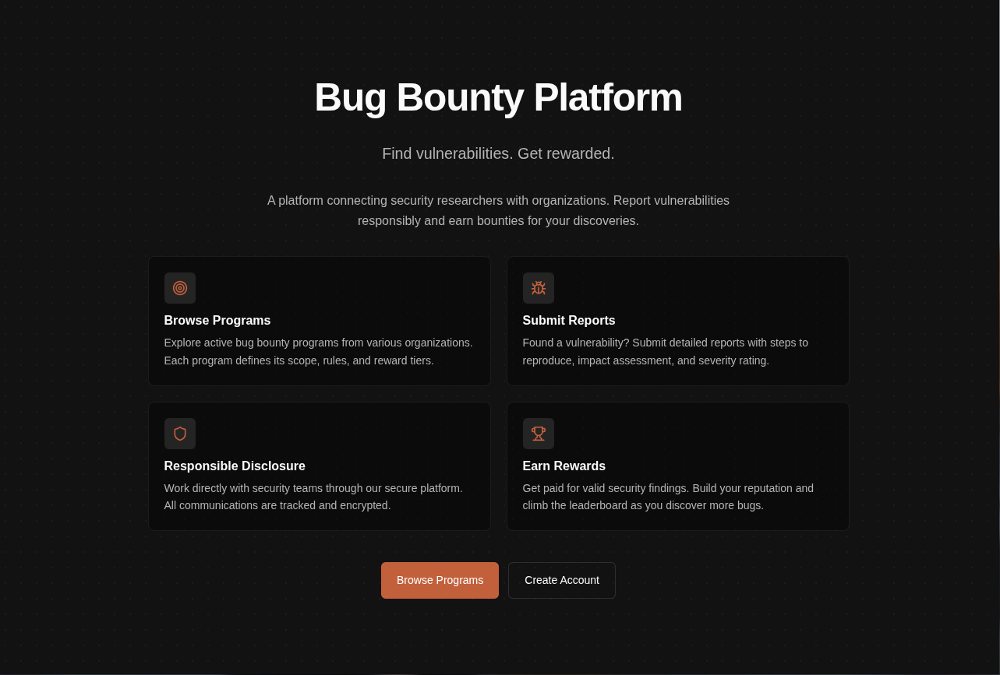
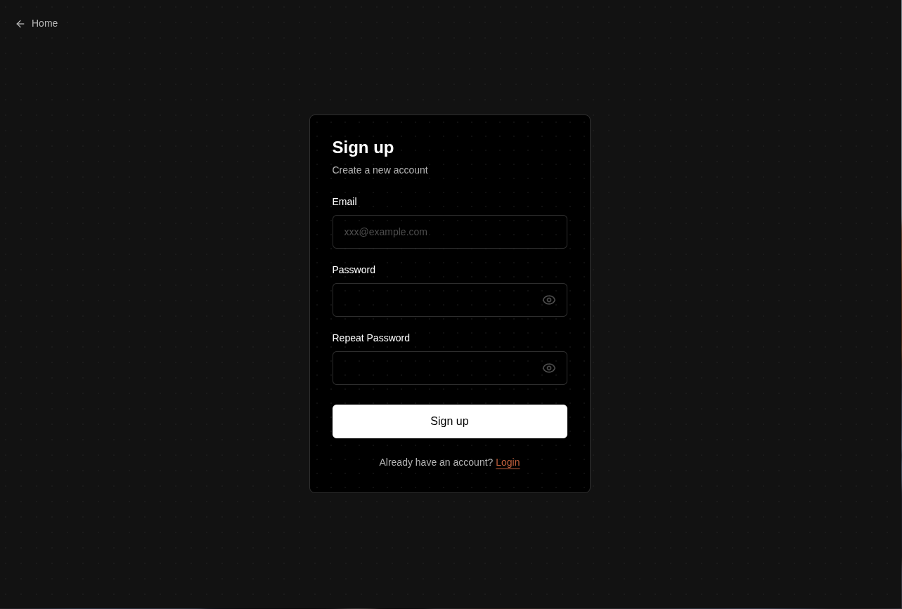
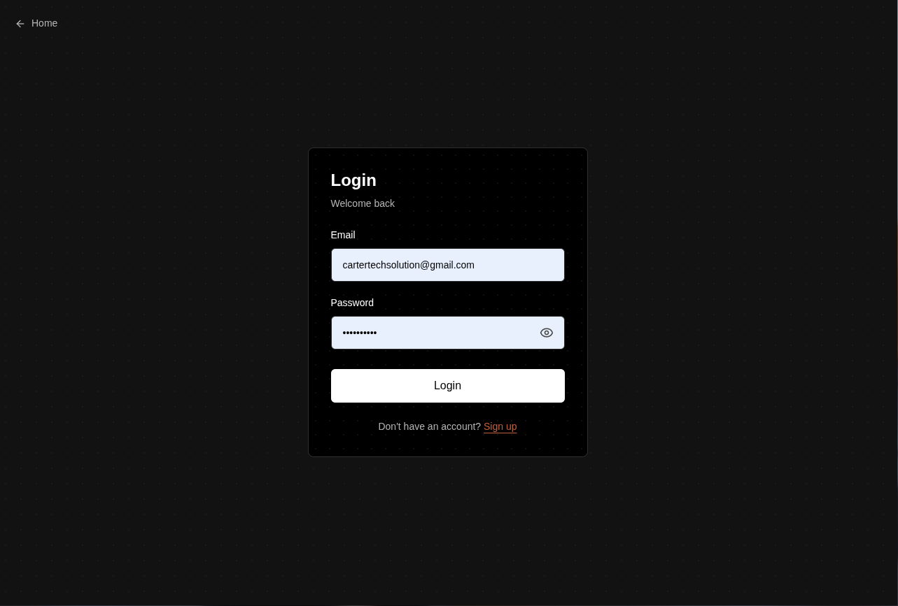
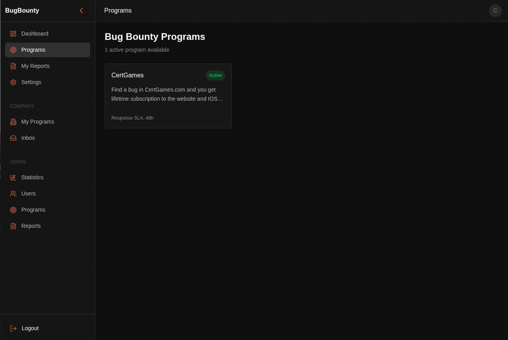
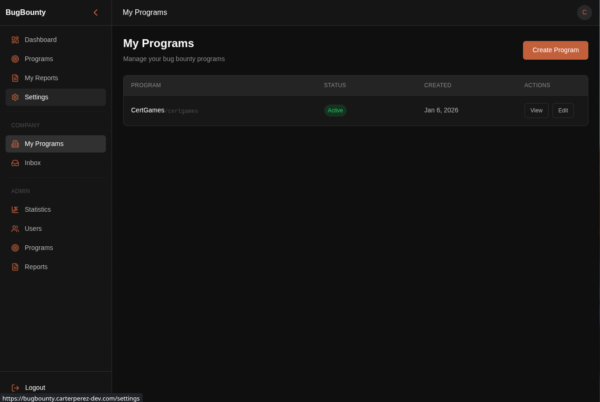
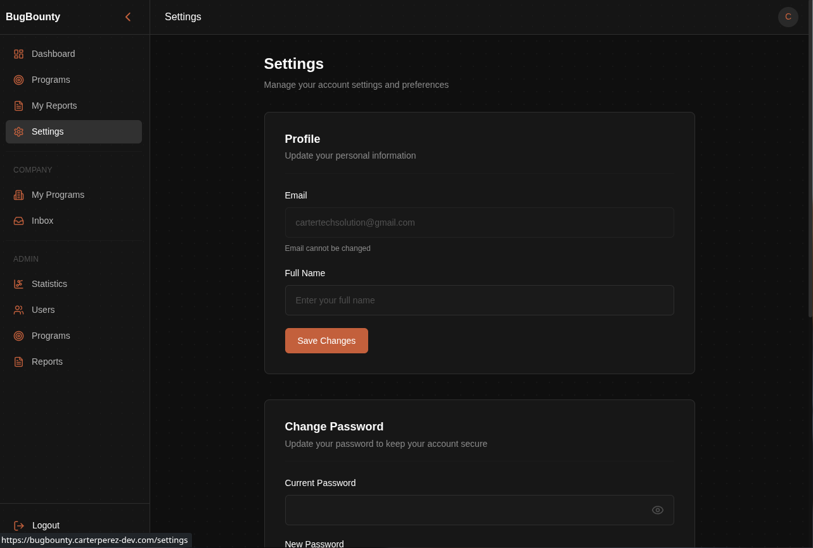
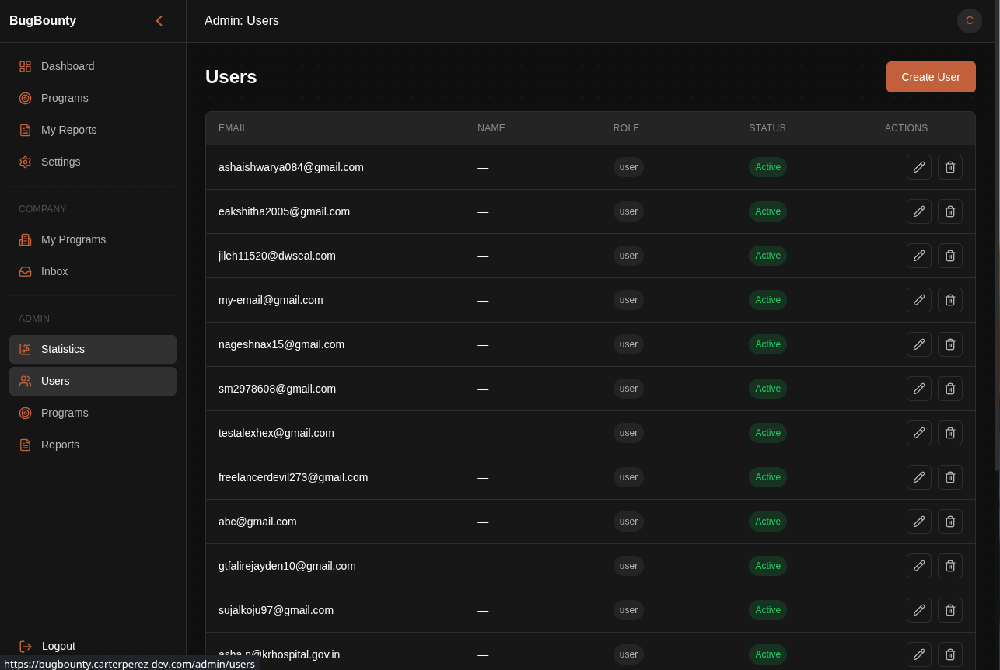

<!-- ©AngelaMos | 2026 -->
<!-- DEMO.md -->

<div align="center">

```ruby
██████╗  ██████╗ ██╗   ██╗███╗   ██╗████████╗██╗   ██╗
██╔══██╗██╔═══██╗██║   ██║████╗  ██║╚══██╔══╝╚██╗ ██╔╝
██████╔╝██║   ██║██║   ██║██╔██╗ ██║   ██║    ╚████╔╝
██╔══██╗██║   ██║██║   ██║██║╚██╗██║   ██║     ╚██╔╝
██████╔╝╚██████╔╝╚██████╔╝██║ ╚████║   ██║      ██║
╚═════╝  ╚═════╝  ╚═════╝ ╚═╝  ╚═══╝   ╚═╝      ╚═╝
```

**Demo & Preview**

<br>

<a href="https://bugbounty.carterperez-dev.com">
  
</a>

<br>

```ruby
docker compose up -d    →    localhost:8420
```

<br>

[Landing](#landing) · [Sign Up](#sign-up) · [Login](#login) · [Programs](#programs) · [Company Programs](#company-programs) · [Settings](#settings) · [User Management](#user-management)

</div>

---

### Landing

Public marketing page introducing the four core flows — browse programs, submit reports, responsible disclosure, and earn rewards



---

### Sign Up

Email and password account creation with confirmation field and inline validation



---

### Login

Credential-based authentication issuing rotating JWT refresh tokens with multi-device session tracking



---

### Programs

Researcher view of active bug bounty programs with reward summary and response SLA per program



---

### Company Programs

Company-side program management with status, creation date, and inline view and edit controls per program



---

### Settings

Profile management and password rotation with current-password verification



---

### User Management

Admin user directory with role and status filtering, account provisioning, and inline edit and delete actions


